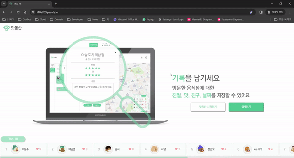
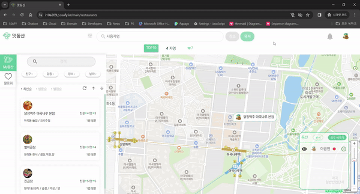
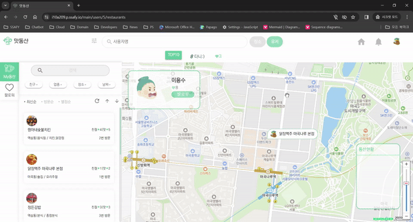
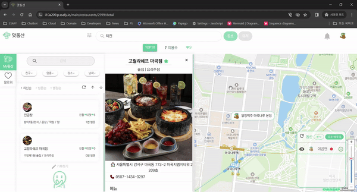
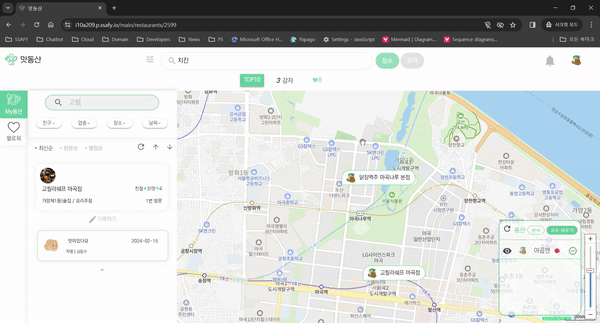

# 맛동산

맛동산은 음식점을 방문한 후 남기는 기록을 쉽게 다시 찾아보거나 다른 사람들과 공유하기를 원하는 사용자들을 위해 탄생했습니다.

맛동산과 함께 맛있는 추억을 남겨보세요!

## 주요 링크

[메인 페이지](http://i10a209.p.ssafy.io/)

[소개 영상](https://youtu.be/jF2EbYaSVDc?si=xOxmrc3Wdxsfr1W8)

# 주요 기능

- `계정` 검색하기
- `계정` 구독하기
- `음식점` 검색하기
- `음식점` 저장하기
- `리뷰` 기록하기
- `리뷰` 검색하기
- 여러 계정의 `저장한 음식점` / `리뷰` 동시에 보기

# 개발 환경

**Management Tool**

**IDE**

**Infra**

**Frontend**

**Backend**

# 서비스 화면

### 로그인 + 회원가입

### 계정 검색하기

### 계정 구독하기

### 음식점 검색하기 + 저장하기

### 리뷰 작성하기

### 리뷰 검색하기

### 여러 계정의 저장한 음식점 + 리뷰 동시에 보기

